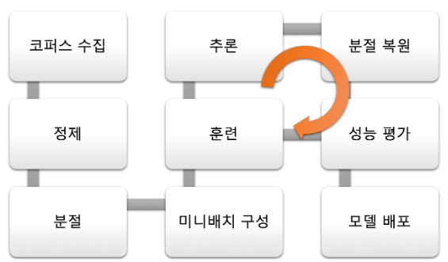

# NLP(Natural Language Processing)

- 목적: 단순히 하나의 개별 단어를 이해하는 것을 넘어, 해당 단어들의 문맥을 이해하려는 것

- e.g. 전체 문장 분류, 문장 내 단어 분류, 텍스트 컨텐츠 생성, 
질의에 대한 정답 추출, 입력 텍스트로부터 새로운 문장 생성

# Pipeline

- 코퍼스 수집
    - 뉴스 기사, 드라마/영화 자막, 위키피디아 등 다양한 소스에서 수집

- 정제
    - 문장 단위로 정렬, 특수 문자 등 노이즈 제거

- 분절
    - 각 언어별 형태소 분석기(POS tagger) 또는 분절기(Tokenizer, Segmenter) 사용하여 띄어쓰기 정제
    - 언어에 따라 Encoding 수행
    - 어휘 목록 구성

- 미니배치 구성
    - 미니배치 내의 문장의 길이가 최대한 같도록 통일
    - 실제 훈련 시에는 미니배치의 순서를 임의로 섞어서 훈련

- 훈련
    - 데이터 양과 크기에 따라 디바이스 선택(CPU/GPU 병렬 사용)

- 추론
    - 풀고자하는 문제에 따라 여러 도메인에 대한 테스트셋 생성
    - 각 도메인의 모델 및 알고리즘 성능 평가

- 분절 복원
    - 실제 사용되는 문장의 형태로 변환

- 성능 평가
    - 기계번역용 정량 평가 방법: BLEU
    - 정성 평가 수행

- 모델 배포(서비스)
    - API 호출 또는 사용자로부터의 입력
    - 추론을 위해 실제 모델에 훈련된 데이터셋과 동일한 형태로 분절
    - 추론: 수행 속도에 대한 최적화
    - 분절 복원
    - API 결과 반환 또는 사용자에게 결과 반환

---
# Reference

1. Natural Language Processing with PyTorch Gitbook: https://kh-kim.gitbook.io/natural-language-processing-with-pytorch/00-cover-13/01-pipeline

---
Contact: <iyhs1858@gmail.com>