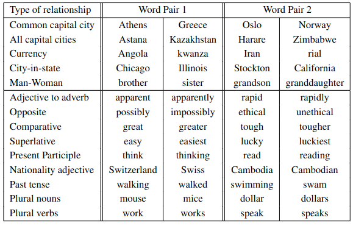
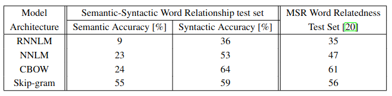

Paper: [Efficient Estimation of Word Representations in Vector Space](https://arxiv.org/pdf/1301.3781.pdf)

Github: 

Dataset: NSMC(Naver Sentiment Movie Corpus)

# Introduction

- 많은 NLP 시스템과 기술들은 단어들 간의 유사성을 고려하지 않았음.

- 음성 인식과 기계 번역과 같은 작업에 제한이 생겨 진전되지 않음.

- 신경망을 기반으로한 언어 모델을 사용하여 N-gram model을 능가함.

## N-gram Model

- 통계학 기반 언어 모델(SLM: Statistical Language Model)

- 다음 단어를 예측하기 위해 문장 내의 모든 단어를 고려하지 않고 특정 단어의 개수(N)만 고려 N(=token)

- **한계점**
    - 희소(Sparsity) 문제: 전체 문서에서 N개의 단어를 연속적으로 갖는 문장 자체의 개수가 드뭄.
    - N값 설정 시의 상충(Trade-off) 문제

## Goal

- 수백만, 수십억 어휘가 포함된 대규모 데이터셋에서 고품질 단어 벡터를 학습시키는 데 사용할 수 있는 모델 제안

- 여러 수준의 유사성을 가지는 단어는 서로 가깝게 존재한다고 예상
    - e.g. 명사의 경우, 여러 단어를 끝으로 사용 가능하며 원래 벡터 공간의 부분 공간에서 끝을 낼 수 있는 유사한 단어를 찾을 수 있음.

- 단어 표현의 유사성은 간단한 구문적 규칙을 뛰어넘음. 
    - e.g. King - Man + Woman = Queen

- 단어 사이의 구문론적, 의미론적인 규칙을 보존하도록 학습하여 높은 성능을 보여주는 새로운 모델을 개발

# Model Architectures

- 신경망을 이용해 단어의 분산 표현을 학습하여 단어 사이의 선형적 규칙을 보존

- 모델의 계산 복잡성을 정의하여 다른 모델 구조와 비교

- O = E x T x Q
    - E: training epochs (3-50)
    - T: the number of the words in the training set (one billion)
    - Q: N x D + N x D x H + H x V : 계산 복잡도

- Stochastic Gradient Descent와 Backpropagation 사용

## Feedforward Neural Net Language Model(NNLM)

- Input, Projection, Hidden, Output Layer로 구성
    - Input: N, 1-of-V coding
    - Projection: V x D shared projection matrix, N x D
    - Hidden: 모든 단어의 확률 분포를 계산하여 V 차원의 Output으로 출력

- Hierarchical softmax를 사용하여 출력하기 위한 계산 복잡도를 log2(V)로 감소.
- N x D x H 에서 병목 현상 존재

# Results

- 5 종류의 의미론적 단어 관계, 9 종류의 구문론적 단어 관계 테스트 데이터 예시

    

- 단어 벡터를 학습시키기 위해 Google News 말뭉치 데이터 사용

- 640 차원의 단어 벡터의 같은 데이터를 사용하여 학습한 모델 구조 비교
    
    CBOW 모델과 비교해서 Skip-gram 모델이 구문론적 정확도에서 약간 떨어지지만 의미론적 정확도에서는 다른 모델들 보다 더 좋은 결과를 보임.

- DistBelief 프레임워크를 사용하여 모델을 대규모 병렬 학습
    - mini-batch asynchronous gradient descent와 Adagrad 사용

